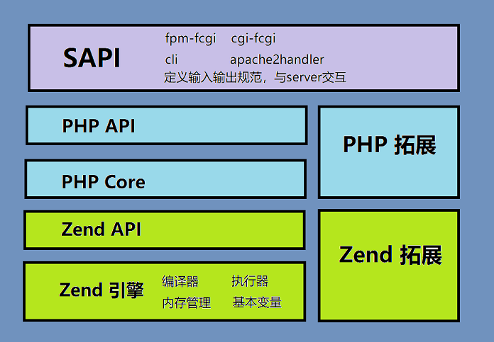

- 配置文件：php-fpm.conf 
- 开启慢日志功能的：
  - slowlog = /usr/local/var/log/php-fpm.log.slow
  - request_slowlog_timeout = 5s
## php-fpm 3种工作模式
### pm=static
- 静态，始终保持一个固定数量的子进程，这个数由（pm.max_children）定义，这种方式很不灵活，也通常不是默认的
### pm= dynamic
- 启动时，会产生固定数量的子进程（由pm.start_servers控制）可以理解成最小子进程数，而最大子进程数则由pm.max_children去控制，OK，这样的话，子进程数会在最大和最小数范围中变化，还没有完，闲置的子进程数还可以由另2个配置控制，分别是pm.min_spare_servers和pm.max_spare_servers，也就是闲置的子进程也可以有最小和最大的数目，而如果闲置的子进程超出了pm.max_spare_servers，则会被杀
### pm = ondemand
- 这种模式把内存放在第一位，他的工作模式很简单，每个闲置进程，在持续闲置了pm.process_idle_timeout秒后就会被杀掉，有了这个模式，到了服务器低峰期内存自然会降下来，如果服务器长时间没有请求，就只会有一个php-fpm主进程，当然弊端是，遇到高峰期或者如果pm.process_idle_timeout的值太短的话，无法避免服务器频繁创建进程的问题，因此pm = dynamic和pm = ondemand谁更适合视实际情况而定
## php-fpm
- fpm是PHP FastCgi运行模式的一个进程管理器，FastCgi是Web服务器（Nginx、Apache）和处理程序之间的一种通信协议
- PHP没有实现Http网络库，而是实现了FastCgi协议，通过与web服务器配合实现http的处理，web服务器处理http请求，将解析的结果通过fastcgi协议转发给PHP程序，PHP程序处理完将结果返回给web服务器，完成请求返回给客户端
## php架构

- Zend 引擎：Zend引擎为PHP提供了基础服务，包括词法分析 语法分析 ，AST抽象语法树编译 opcodes执行，PHP的变量设计、内存管理、进程管理。
- PHP层：绑定了SAPI层并处理与它的通信，它同时对safe_mode和open_basedir的检测提供一致的控制层，将fopen()、fread()和fwrite()等用户空间的函数与文件和网络I/O联系起来。
- SAPI：包括了cli fpm等，- 把接口对外接口都抽象出来，只要遵守SAPI协议便可以实现一个server。
- 拓展：zend 引擎提供了核心能力和接口规范，在此基础上可以开发拓展
  - 这里的拓展分为了两种，通常在php.ini中，通过extension=加载的扩展我们称为PHP扩展，通过zend_extension=加载的扩展我们称为Zend扩展，但从源码的角度来讲，PHP扩展应该称为“模块”（源码中以module命名），而Zend扩展称为“扩展”（源码中以extension命名）。两者最大的区别在于向引擎注册的钩子，向用户层面提供一些C实现的PHP函数，需要用到zend_module_entry（即作为PHP扩展），而需要hook到Zend引擎的话，就得用到zend_extension（即作为Zend扩展）
  
## php解析过程

- 词法分析，把源代码切割成多个字符串单元（Token）
- 语法分析器把Token转换成AST抽象语法树
- 抽象语法树转换成opcodes(opcode指令集合)
- 虚拟机解释执行执行opcodes(opcode是一组指令标识，对应handler处理函数)
## php-fpm 生命周期
- php生命周期中4个关键调用 MINT->RINT->RSHUTDOWN->MSHUTODWN
- php的运行模式有两种：web模式和cli模式。无论是哪种公众模式，php的工作原理都是一样的，都是作为一种SAPI运行。首先，认识下SAPI
- 常见的SAPI有cli、cgi、php-fpm以及各服务具体的sapi
- 在nginx中的生命周期
- -->php随服务器启动并通过php-fpm(ASPI)与nginx相连,加载扩展代码并调用其模块初始化程序(MINT),分配
- -->PHP等待SAPI层请求处理的页面,每个请求都会执行RINT
- --> php脚本执行
- --> php脚本结束,PHP调用每个扩展的请求关闭(RSHUTDOWN)函数,执行最后的清理工作,垃圾回收
- --> 如果停止fpm,及SAPI关闭,则php调用每个拓展函数(MSHUTODWN)

## SAPI运行PHP都经过下面几个阶段:
1. 模块初始化阶段（module init）：
这个阶段主要进行php框架、zend引擎的初始化操作。这个阶段一般是在SAPI启动时执行一次. 对于FPM而言，就是在fpm的master进行启动时执行的。php加载每个扩展的代码并调用其模块初始化例程（MINIT），进行一些模块所需变量的申请,内存分配等。

2. 请求初始化阶段（request init）：
当一个页面请求发生时，在请求处理前都会经历的一个阶段。对于fpm而言，是在worker进程accept一个请求并读取、解析完请求数据后的一个阶段。在这个阶段内，SAPI层将控制权交给PHP层，PHP初始化本次请求执行脚本所需的环境变量。

3. php脚本执行阶段
php代码解析执行的过程。Zend引擎接管控制权，将php脚本代码编译成opcodes并顺次执行

4. 请求结束阶段（request shutdown）：
请求处理完后就进入了结束阶段，PHP就会启动清理程序。这个阶段，将flush输出内容、发送http响应内容等，然后它会按顺序调用各个模块的RSHUTDOWN方法。 RSHUTDOWN用以清除程序运行时产生的符号表，也就是对每个变量调用unset函数。

5. 模块关闭阶段（module shutdown）：
该阶段在SAPI关闭时执行，与模块初始化阶段对应，这个阶段主要是进行资源的清理、php各模块的关闭操作，同时，将回调各扩展的module shutdown钩子函数。这是发生在所有请求都已经结束之后，例如关闭fpm的操作。（这个是对于CGI和CLI等SAPI，没有“下一个请求”，所以SAPI立刻开始关闭。）
## php 垃圾回收
- PHP进行内存管理的核心算法一共两项：一是引用计数，二是写时拷贝。当你声明一个PHP变量的时候，C语言就在底层给你搞了一个叫做zval的struct（结构体）；如果你还给这个变量赋值了，比如“hello world”，那么C语言就在底层再给你搞一个叫做zend_value的union（联合体)

## php 设计模式
- 单例模式
- 工厂模式
- 策略模式
- 注册模式
- 适配器模式
- 观察者模式
