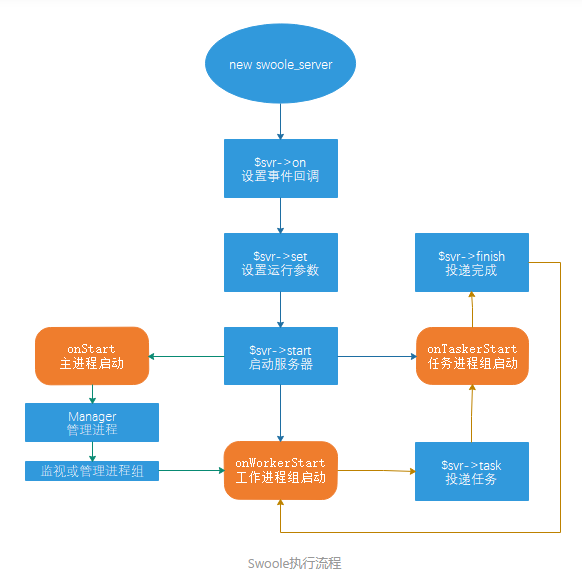

## 栈和堆
- 栈空间是在应用在编译过程中已经分配好了的,大小固定
- 堆空间是都代码执行的时候分配的,大小
## 进程,线程,协程
- 进程是计算资源分配和调度的基本单位,进程之间的内存不共享
- 线程没有系统资源,共享进程的资源,线程和线程相互调用,
- 线程是程序中一个单一的顺序控制流程
- 一个进程或线程可以有多个协程,协程上下文切换由程序控制,线程上下文切换由系统控制
### 线程独享资源
 1. 程序计数器
 2. 寄存器
 3. 栈
 4. 状态字
 
### 线程共享资源
1. 地址空间
2. 全局变量
3. 打开的文件
4. 子线程
5. 闹钟
6. 信号及信号服务
7. 记账信息

## swoole协程实现
- 开启协程之后,相当于切换到异步io
- 调用 SwooleHttpServer 的 onRequest 事件回调函数时，底层会调用 C 函数 coro_create 创建一个协程，同时保存这个时间点的 CPU 寄存器状态和 ZendVM 堆栈信息；
- 调用 mysql->connect 时会发生 IO 操作，底层会调用 C 函数 coro_save 保存当前协程的状态，包括 ZendVM 上下文以及协程描述信息，并调用 coro_yield 让出程序控制权，当前的请求会挂起；
- 协程让出程序控制权后，会继续进入 HTTP 服务器的事件循环处理其他事件，这时 Swoole 可以继续去处理其他客户端发来的请求；
- 当数据库 IO 事件完成后，MySQL 连接成功或失败，底层调用 C 函数 coro_resume 恢复对应的协程，恢复 ZendVM 上下文，继续向下执行 PHP 代码；
mysql->query 的执行过程与 mysql->connect 一样，也会触发 IO 事件并进行一次协程切换调度；

## swoole生命周期

1. 初始化 Manager 管理进程,创建work工作进程,监听tco/udp端口,和定时器
2. onStart onStart回调函数是在master主进程中执行,和onWork子进程是并行,没有先后之分
3. onReceive 客户端请求的数据到达时会调用onReceive函数，客户端发送的多次请求，服务端是可以一次性接收的，所以会发现一个问题是onReceive接收的数据会非常大
4. onWorkerStop Worker工作子进程退出时回调onWorkerStop函数
5. onShutDown Swoole服务停止时回调onShutDown函数，然后继续PHP-FPM的第5~6步，最后退出PHP的生命周期